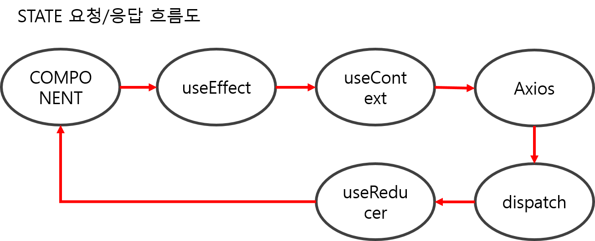
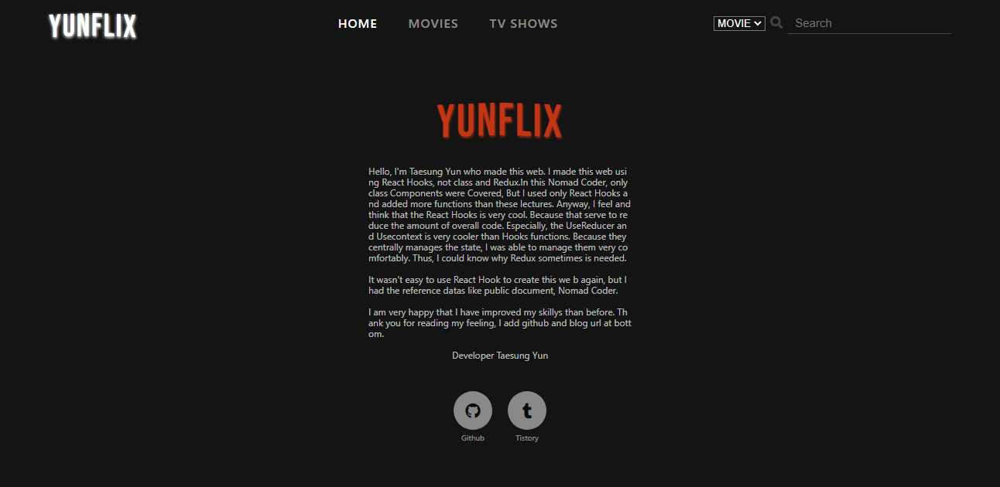
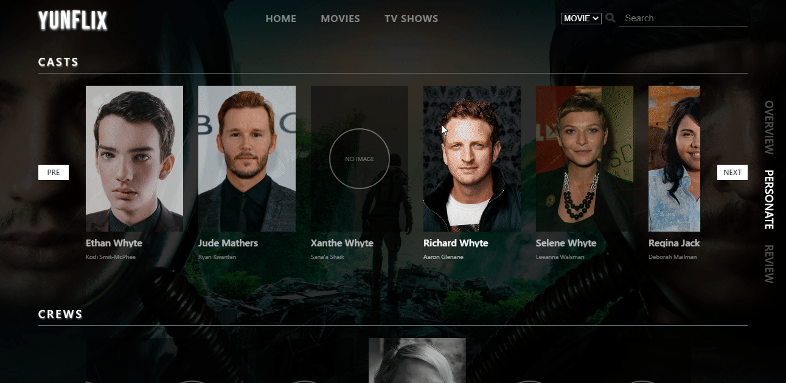

# YUNFLIX

## 🙋‍♂️ 소개(Intro)

**YUNFLIX**는 **리액트 훅(React Hook)과The Movie DB Api**를 이용해서 만든 웹 사이트입니다. 

**YUNFLIX**는 **최신 영화/TV SHOW, 최신 영화/SHOW 중 가장 인기있는 TOP 20, API내에서 가장 인기 있는 TOP 20** 데이터를 볼 수 있으며, **각 영화/TV SHOW에 대한 PREVEW 영상 및 개요(OVERVIEW), 출연진(PERSONATE), 리뷰(REVIEW)** 데이터를 볼 수 있습니다. 

또한, 원하는 자료가 있으면 Movie와 TV Show를 구분하여 검색어를 입력한 후 검색을 할 수 있으며, 모든 결과물을 불 수 있게 페지네이션(Pagination)을 구현하였습니다.  
   

    

**리액트 훅(React Hooks)를 이용한 이유**는 <u>코드의 간결화와 편리하게 state를 관리하기 위함</u>입니다. 각 라우트 컴포넌트에 맞는 데이터를 Axios를 이용해서 받았고, 그 데이터를 state에 담아서 컴포넌트로 전송하기 위해 useContext와 useReducer를 사용하였습니다.  

## 🌞 PREVIEW

[사이트 주소(Netilix)](https://fervent-shirley-991dad.netlify.app/)
 
 

## 📖 프레임워크

  

## ⚙ 컴포넌트

#### HOME

- 소개글 및 Contact us(깃허브, 티스토리)
    
  
     

#### MOVIES

- Popular 20, Top rated 20, Now playing 20
    
     

#### SHOWS

- Popular 20, Top rated 20, Airing Today 20
    
     

#### Detail

- Overview, Personate, Review

1. 개요(Overview)
     
     
     
     
2. 출연진(Personate)
     
     
3. 리뷰
     
      

#### SEARCH

- Search, Pagination
    
     
